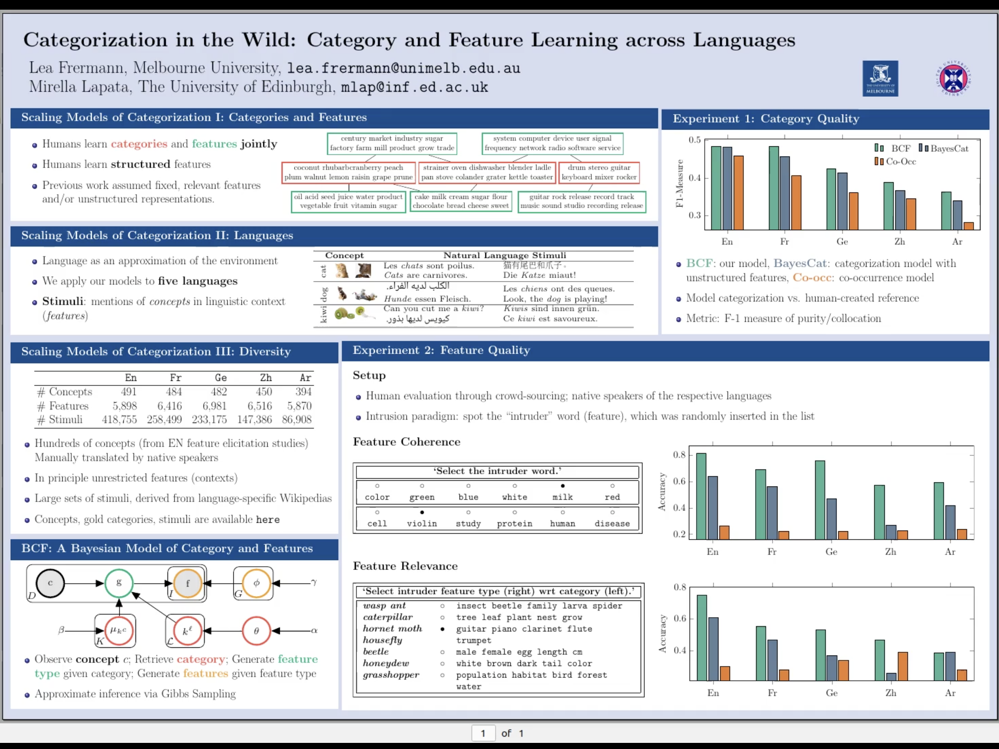
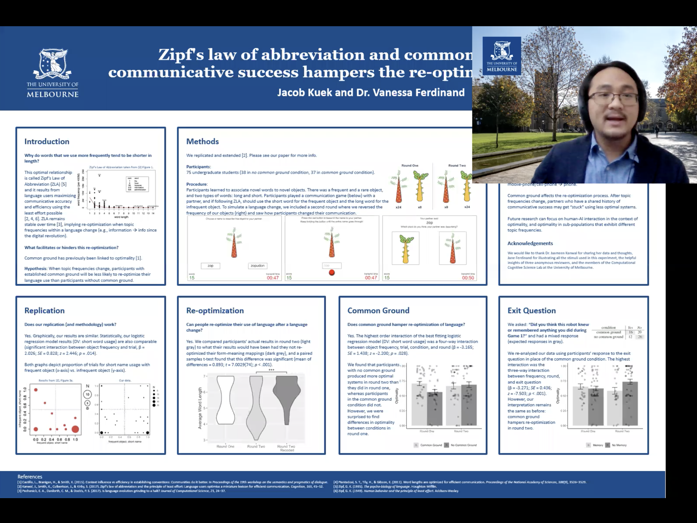

### Projects featured at the meetup

Milan Andrejevic, Joshua White, Daniel Feuerriegel, Simon Laham & Stefan Bode

Response time modelling reveals evidence for multiple, distinct sources of moral decision caution  (MathPsych 2021)

Lea Frermann & Mirella Lapata

Categorization in the Wild: Category and Feature Learning across Languages (CogSci 2021)

[poster pdf,](http://frermann.de/multiling_categories/cogsci2021_poster.pdf ) [paper pdf](http://frermann.de/multiling_categories/cogsci2021_paper.pdf )

Piers Howe, Andrew Perfors & Keith Ransom

What interventions can decrease or increase belief polarisation in a population of rational agents? (CogSci 2021)

[paper pdf]( https://psyarxiv.com/ej2wm/ )

Jacob Kuek & Vanessa Ferdinand 

Zipf’s law of abbreviation and common ground: Past communicative success
hampers the re-optimization of language (CogSci 2021)

[poster pdf,](images/kuek_poster.pdf ) [paper pdf](images/kuek_paper.pdf )

Kevin Shabahang, Hyungwook Yim & Simon Dennis

Free Associations as Steady-states in Dynamic Spaces (MathPsych/ICCM 2021)

### Other recent projects from Melbourne

Keith Ransom, Andrew Perfors & Rachel Stephens, 

Social meta-inference and the evidentiary value of consensus (MathPsych 2021, CogSci 2021)

[paper pdf]( https://psyarxiv.com/49sb5/ )

Aurélien Fermo and Charles Kemp

Temporal Continuity and the Judgment of Actual Causation (CogSci 2021)

[paper pdf]( http://www.charleskemp.com/papers/fermok_temporalcontinuityandthejudgmentofactualcausation.pdf   )

Hyungwook Kim, Olivera Savic, Alex Barkheimer, Vladimir Sloutsky & Simon Dennis 

The mystery of early taxonomic development (CogSci 2021)

[paper pdf](  http://lapensee.ivyro.net/my_articles/peer/YimSavicBarkhimeSloutskyDennis_2021_CogSci.pdf )

